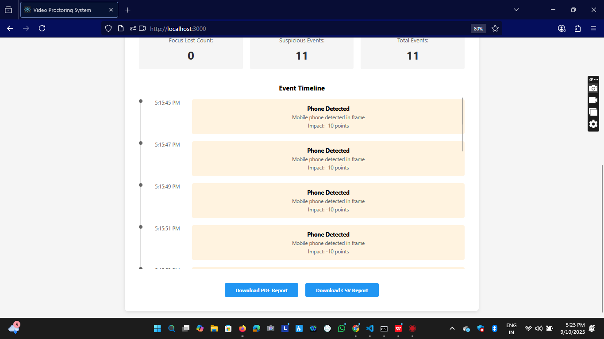
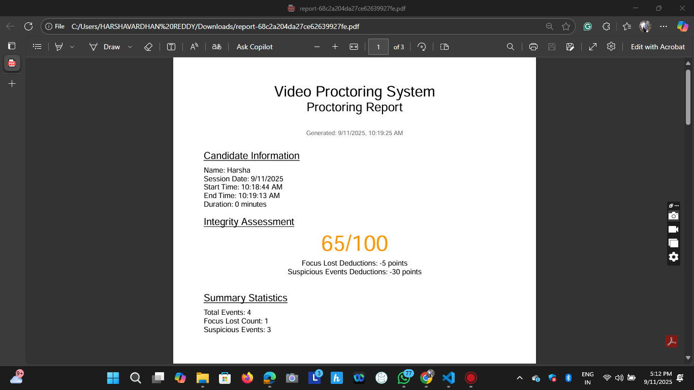
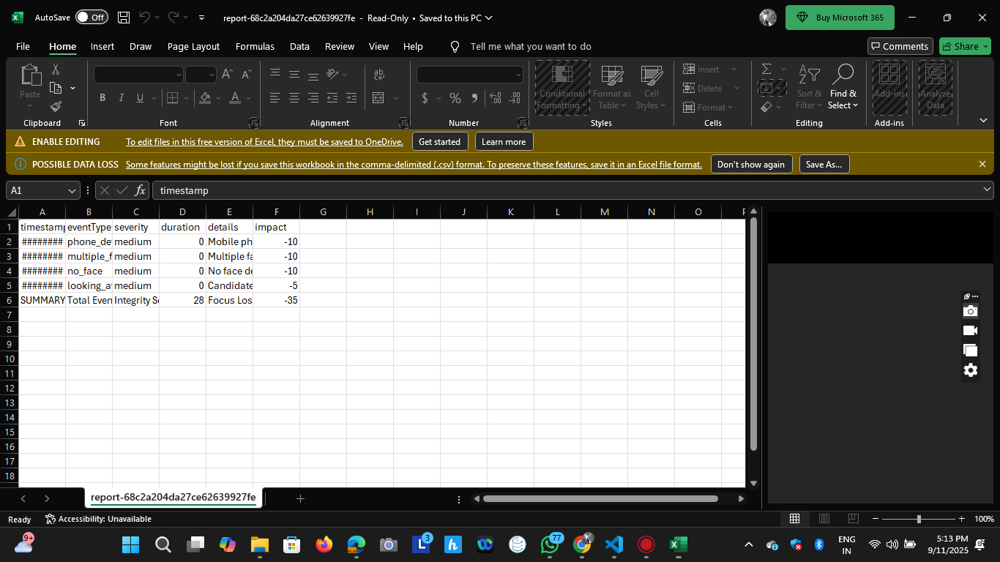

# 🎥 Video Proctoring System

An AI-powered real-time video proctoring system that monitors candidates during online interviews using computer vision and machine learning.

<div align="center">
  
[](https://video-proctoring-frontend-6g08broai.vercel.app)
[](https://video-proctoring-backend-hu6b.onrender.com/health)

</div>

## 🌐 Live Demo

- **Frontend Application**: [https://video-proctoring-frontend-lrxjayfbt.vercel.app](https://video-proctoring-frontend-6g08broai.vercel.app)
- **Backend API**: [https://video-proctoring-backend-hu6b.onrender.com](https://video-proctoring-backend-hu6b.onrender.com)
- **API Health Check**: [https://video-proctoring-backend-hu6b.onrender.com/health](https://video-proctoring-backend-hu6b.onrender.com/health)

## 📋 Features

### Core Functionality
- ✅ **Real-time Face Detection** - Monitors candidate presence and attention
- ✅ **Object Detection** - Identifies phones, books, and unauthorized devices
- ✅ **Focus Tracking** - Detects when candidate looks away from screen
- ✅ **Multiple Person Detection** - Alerts when multiple faces are detected
- ✅ **Live Dashboard** - Real-time monitoring with charts and statistics
- ✅ **Integrity Score** - Automated scoring based on violations
- ✅ **Comprehensive Reports** - PDF and CSV export functionality
- ✅ **Session Recording** - Video recording with playback capability

### Technical Features
- 🔄 Real-time updates using Socket.io
- 📊 Interactive charts using Chart.js
- 🤖 AI-powered detection using TensorFlow.js
- 📱 Responsive design for all devices
- 🔒 Secure session management
- ☁️ Cloud-based deployment

## 🛠️ Tech Stack

### Frontend
- **React.js** - UI Framework
- **TensorFlow.js** - Client-side ML
- **COCO-SSD** - Object detection model
- **Socket.io Client** - Real-time communication
- **Chart.js** - Data visualization
- **React Webcam** - Camera integration

### Backend
- **Node.js** - Runtime environment
- **Express.js** - Web framework
- **MongoDB** - Database
- **Socket.io** - WebSocket communication
- **PDFKit** - PDF generation
- **Multer** - File handling

### Deployment
- **Frontend**: Vercel
- **Backend**: Render.com
- **Database**: MongoDB Atlas

## 🚀 Getting Started

### Prerequisites
- Node.js (v16 or higher)
- MongoDB
- Git
- Webcam/Camera

### Installation

1. **Clone the repository**
```bash
git clone https://github.com/reddyharshavardhan/video-proctoring-system.git
cd video-proctoring-system
```

2. **Setup Backend**
```bash
cd backend
npm install
```

Create `.env` file:
```env
PORT=5000
MONGODB_URI=your_mongodb_connection_string
```

3. **Setup Frontend**
```bash
cd ../frontend
npm install
```

Create `.env` file:
```env
REACT_APP_API_URL=http://localhost:5000/api
REACT_APP_SOCKET_URL=http://localhost:5000
```

### Run the Application

**Backend:**
```bash
cd backend
npm run dev
```

**Frontend:**
```bash
cd frontend
npm start
```

## 📸 Screenshots

<div align="center">

### 🎥 Video Capture Interface


*Live webcam feed with real-time monitoring, session statistics panel, alert notifications, and test controls*

---

### 📊 Dashboard


*Real-time event timeline chart, event distribution analytics, live event feed, and summary statistics*

---

### 📋 Report Generation


*Comprehensive PDF reports, CSV data export, integrity score visualization, and detailed event timeline*

📄 PDF Report Sample


Generated PDF report showing session summary, integrity score, violation details, and timeline analysis

📊 CSV Data Export


CSV file format showing structured data export with timestamps, event types, and violation records for further analysis

</div>

## 🎮 Usage

### Start a Session
1. Enter candidate name
2. Click "Start Session"
3. Grant camera permissions

### Monitoring
- System automatically monitors for violations
- Real-time alerts appear for:
  - Looking away (>5 seconds)
  - No face detected (>10 seconds)
  - Multiple faces
  - Unauthorized objects

### View Analytics
1. Switch to Dashboard tab
2. Monitor real-time statistics
3. View event timeline

### Generate Report
1. Go to Report tab
2. Review session summary
3. Download PDF or CSV report

## 📊 Proctoring Events

| Event Type | Description | Score Deduction |
|------------|-------------|-----------------|
| Focus Lost | Looking away >5s | -5 points |
| No Face | No face >10s | -10 points |
| Multiple Faces | Multiple people | -10 points |
| Phone Detected | Mobile visible | -10 points |
| Book Detected | Notes visible | -10 points |

## 🔧 API Documentation

### Endpoints

| Method | Endpoint | Description |
|--------|----------|-------------|
| POST | `/api/proctor/start-session` | Start new session |
| POST | `/api/proctor/end-session/:id` | End session |
| POST | `/api/proctor/log-event` | Log detection event |
| GET | `/api/report/session/:id` | Get session data |
| GET | `/api/report/pdf/:id` | Download PDF |
| GET | `/api/report/csv/:id` | Download CSV |

## 🌍 Environment Variables

### Backend
```env
PORT=5000
MONGODB_URI=mongodb+srv://...
NODE_ENV=production
```

### Frontend
```env
REACT_APP_API_URL=https://api-url/api
REACT_APP_SOCKET_URL=https://api-url
```

## 📝 Project Structure

```
video-proctoring-system/
├── backend/
│   ├── models/
│   │   ├── Session.js      # Session schema
│   │   └── Event.js        # Event schema
│   ├── routes/
│   │   ├── proctor.js      # Proctoring endpoints
│   │   └── report.js       # Report endpoints
│   ├── middleware/
│   │   └── upload.js       # File upload config
│   ├── utils/
│   │   └── reportGenerator.js  # PDF/CSV generation
│   ├── server.js           # Express server
│   └── package.json
├── frontend/
│   ├── public/
│   └── src/
│       ├── components/
│       │   ├── VideoCapture.js    # Main video component
│       │   ├── ProctorDashboard.js # Analytics dashboard
│       │   └── Report.js          # Report view
│       ├── services/
│       │   ├── api.js            # API calls
│       │   └── detection.js      # AI detection logic
│       ├── styles/
│       │   └── App.css          # Styling
│       ├── App.js              # Main app component
│       └── index.js            # React entry point
└── README.md
```

## 🤝 Contributing

1. Fork the repository
2. Create your feature branch (`git checkout -b feature/AmazingFeature`)
3. Commit changes (`git commit -m 'Add AmazingFeature'`)
4. Push to branch (`git push origin feature/AmazingFeature`)
5. Open a Pull Request


